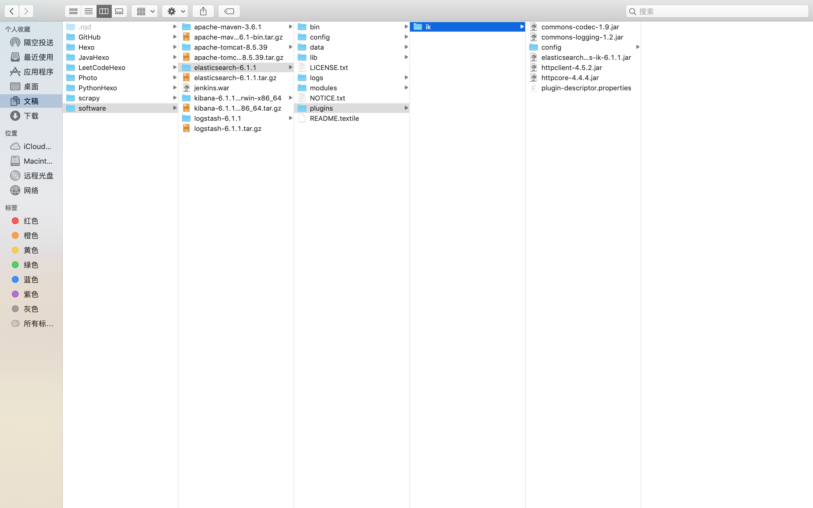

# 6.03


## ELK Tutorial

启动elasticsearch和kibana

```shell
software/elasticsearch-6.1.1/bin
./elasticsearch

software/kibana-6.1.1-darwin-x86_64/bin

./kibana
```

ELk

Elasticsearch

### Mapping

新增操作

```json
PUT /test_index
```

```json
{
  "acknowledged": true,
  "shards_acknowledged": true,
  "index": "test_index"
}
```

查询操作

```
GET _cat/indices
```

```
yellow open .kibana                     WcS-4m6NRTC1LhOrjmgSBA 1 1    3 1 19.5kb 19.5kb
yellow open apache_logs_failure_2019.04 3i4qwnFHT_mbFafPBrpe_g 5 1    1 0  9.2kb  9.2kb
yellow open apache_logs_2015.05         EBUv_DMPROuN2oJlV82Lkw 5 1 9999 0  5.4mb  5.4mb
yellow open test_index                  6VWiCFHNSCStnZ2fepq1Gw 5 1    0 0  1.1kb  1.1kb
yellow open testairbnb                  HF9VCnB6TgaJl58oxmdpvg 5 1 2125 0  2.4mb  2.4mb
```

删除操作

```
DELETE test_index
```

```json
{
  "acknowledged": true
}
```

### Doc

添加文档，由于没有创建index所以会自动建立index

```
PUT /test_index/doc/1
{
  "username":"alfred",
  "age":1
}
```

```json
{
  "_index": "test_index",
  "_type": "doc",
  "_id": "1",
  "_version": 1,
  "result": "created",
  "_shards": {
    "total": 2,
    "successful": 1,
    "failed": 0
  },
  "_seq_no": 0,
  "_primary_term": 1
}
```

不传id会自动生成id

```
POST /test_index/doc
{
  "username":"tom",
  "age":20
}
```

```json
{
  "_index": "test_index",
  "_type": "doc",
  "_id": "aCQUIGsBBuR2RFLJtvJo",
  "_version": 1,
  "result": "created",
  "_shards": {
    "total": 2,
    "successful": 1,
    "failed": 0
  },
  "_seq_no": 0,
  "_primary_term": 1
}
```

根据id查询

```
# query document
GET /test_index/doc/1
```

```json
{
  "_index": "test_index",
  "_type": "doc",
  "_id": "1",
  "_version": 1,
  "found": true,
  "_source": {
    "username": "alfred",
    "age": 1
  }
}
```

查询全部结果

```
# query
GET /test_index/doc/_search
```

```json
{
  "took": 4,
  "timed_out": false,
  "_shards": {
    "total": 5,
    "successful": 5,
    "skipped": 0,
    "failed": 0
  },
  "hits": {
    "total": 2,
    "max_score": 1,
    "hits": [
      {
        "_index": "test_index",
        "_type": "doc",
        "_id": "aCQUIGsBBuR2RFLJtvJo",
        "_score": 1,
        "_source": {
          "username": "tom",
          "age": 20
        }
      },
      {
        "_index": "test_index",
        "_type": "doc",
        "_id": "1",
        "_score": 1,
        "_source": {
          "username": "alfred",
          "age": 1
        }
      }
    ]
  }
}
```

条件查询

```
GET /test_index/doc/_search
{
  "query":{
    "term": {
      "_id": "1"
    }
  }
}
```


```
# bulk api
POST _bulk
{"index":{"_index":"test_index","_type":"doc","_id":"3"}}
{"username":"alfred","age":20}
{"delete":{"_index":"test_index","_type":"doc","_id":"1"}}
{"update":{"_id":"2","_index":"test_index","_type":"doc"}}
{"doc":{"age":"20"}}

# multi_get
GET /_mget
{
  "docs": [
    {"_index": "test_index","_type": "doc","_id": "3"},
    {"_index": "test_index","_type": "doc","_id": "2"}
  ]
}
```


### ES插件安装

安装ik分词器

<https://github.com/medcl/elasticsearch-analysis-ik/releases/tag/v6.1.1>

下载后把解压放入plugin目录即可(需要改文件名)



```
多人一起开发项目的时候总是要搭建环境和部署环境的，这个时候必须得有个python第三方包的list，一般都叫做requirements.txt。 如果一个项目使用时virtualenv环境，还好办 pip freeze 就可以解决，但是如果一个项目的依赖list没有维护，而且又是环境混用，那就不好整理。不过，这里推荐一个python模块pipreqs，可以自动根据源码生成 requirements.txt

使用pip freeze生成requirements.txt

 pip freeze > requirements.txt
使用 pipreqs

这个工具的好处是可以通过对项目目录的扫描，自动发现使用了那些类库，自动生成依赖清单。

缺点是可能会有些偏差，需要检查并自己调整下。

# pip install pipreqs
```

